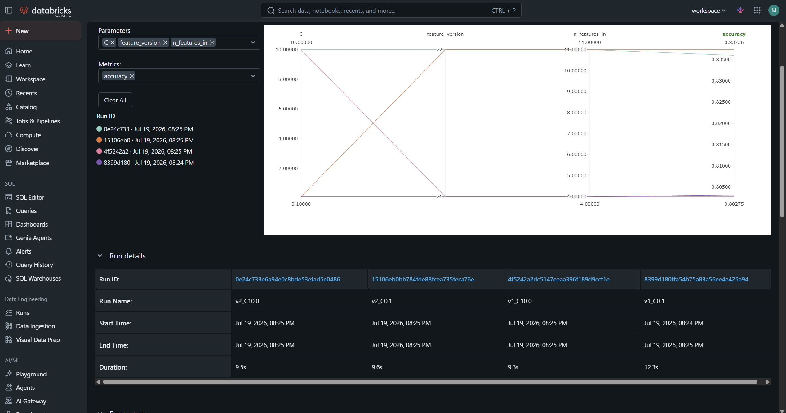
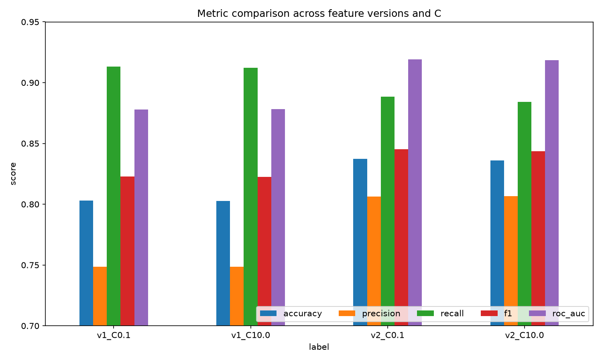
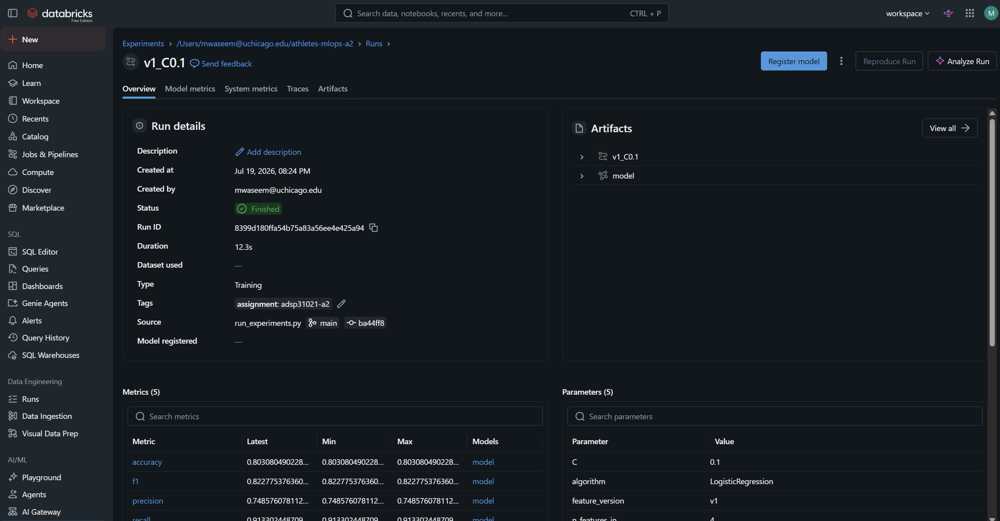
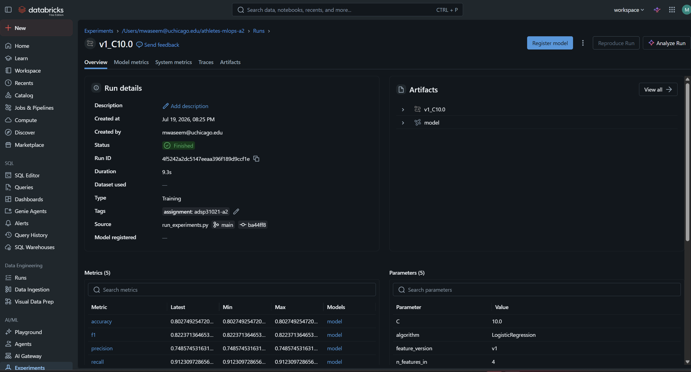
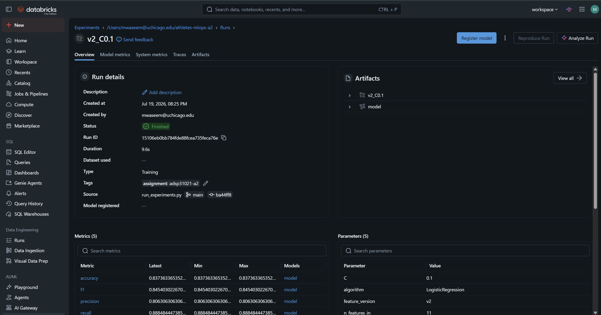
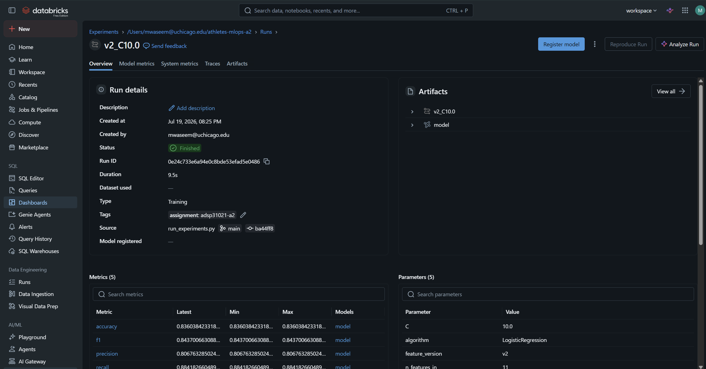

# Experiment Comparison Summary

**ADSP 31021 Assignment 2, Feature Store**
Algorithm: LogisticRegression (held constant across all runs)
Tracking: MLflow on Databricks, experiment `athletes-mlops-a2`

## Experiment design

Four experiments from a 2 x 2 grid: two feature versions crossed with two
hyperparameter configurations, one algorithm throughout.

| Factor | Values |
|--------|--------|
| Feature version | v1 (baseline demographics), v2 (engineered + lifestyle) |
| Hyperparameter `C` | 0.1 (stronger regularization), 10.0 (weaker) |
| Algorithm | LogisticRegression (fixed) |

**Feature versions.** v1 uses `age, height, weight, gender` (4 features). v2 adds
`bmi`, a binned `age_bin`, and training-lifestyle survey fields (`region,
experience, schedule, howlong, eat`), for 11 features. The four strength lifts
are excluded from both versions because the target is derived from them.

**Target.** `high_total_lift`: 1 if an athlete's total lift is at or above the
population median, else 0. Balanced classes (positive share ≈ 0.50), so accuracy
is meaningful.

## Results

| Run | Feature version | C | n_features | Accuracy | Precision | Recall | F1 | ROC-AUC |
|-----|-----------------|-----|-----------|----------|-----------|--------|--------|---------|
| v1_C0.1 | v1 | 0.1 | 4 | 0.803 | 0.749 | 0.913 | 0.823 | 0.878 |
| v1_C10.0 | v1 | 10.0 | 4 | 0.803 | 0.749 | 0.912 | 0.822 | 0.878 |
| v2_C0.1 | v2 | 0.1 | 11 | 0.837 | 0.806 | 0.888 | 0.845 | **0.919** |
| v2_C10.0 | v2 | 10.0 | 11 | 0.836 | 0.807 | 0.884 | 0.844 | 0.918 |

Source: `reports/experiment_summary.csv` (pulled from the logged MLflow runs).
Charts: `reports/metric_comparison.png`, `reports/roc_auc_comparison.png`.

## Findings

1. **Feature version is the dominant factor.** Moving from v1 to v2 raises
   ROC-AUC from 0.878 to 0.919 and improves every metric. The engineered and
   lifestyle features carry real predictive signal beyond bare demographics.

2. **The hyperparameter barely matters.** Within each feature version, changing
   `C` from 0.1 to 10.0 shifts metrics only in the third or fourth decimal. The
   model sits in a stable regularization regime for this data, so it is
   insensitive to `C` across two orders of magnitude.

3. **Best model: v2 at C = 0.1** (ROC-AUC 0.919), effectively tied with
   v2 at C = 10.0.

4. **v1 error profile.** v1 shows high recall (~0.91) with lower precision
   (~0.75). With only demographics available, it over-predicts the high-tier
   class. v2 rebalances this (precision rises to ~0.81 with recall ~0.89).

## Conclusion

The comparison isolates the effect of feature enrichment from hyperparameter
tuning. On this dataset, investing in features (the v1 to v2 step) produced a
meaningful gain, while hyperparameter variation did not. This is the practical
argument for a feature store with versioned feature definitions: improvements
came from changing what the model sees, and each feature version is stored,
tracked, and reproducible.

## Evidence

<!-- Add MLflow screenshots below as image references, e.g.: -->
### 1. All 4 Runs

### 2. Induvidual Runs

#### v1_C0.1

#### v1_C10.0

#### v2_C0.1

#### v2_C10.0
